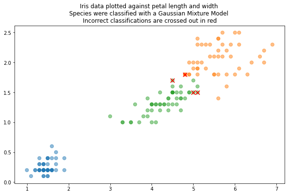
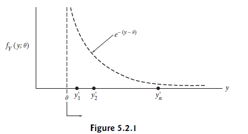

In my stat's class, we are using Larsen's 6th edition of `An Introduction to Mathematical Statistics and Its Applications.` This week, we are doing chapter 5, estimators. If you want a good rundown of MLE, there are tons of other resources at the end of this post.

# Likelihood Function v. Probability Function

)

Last semester, we did a lot of exploration with the [iris dataset](https://www.kaggle.com/datasets/uciml/iris). Briefly, the iris dataset contains data on 150 iris flowers. There are 3 different species of flowers (50 of each iris species) and each flower has 4 measurements/features (petal width/length, sepal width/length). We played with different ways to cluster the iris by species by looking at the more distinguishable features. *Spoiler, petal length and petal width varies the most between iris species!*

One clustering method we used was Gaussian Mixture Models (GMM). The whole dataset was the sum of 3 different iris species so our GMM was the sum of 3 normal distributions. To write the normal distribution for each of the iris species, all you need is the mean and standard deviation for each species. Lastly, we classify the flowers into the most likely species group (by comparing the maximum likelihoods for each flower species).

One could simply calculate parameter values for the species' distributions but we took it one step more and wanted to find the *best* estimators for mean and standard deviation! We used expectation maximization, a method that uses the data to calculate the conditional probability of the species cluster using estimated parameters. The algorithm cycles, modifying the parameters until the probability converges.

$$P(species|data)=\frac{P(species) * \left(pdf \text{ of species with estimated parameters}\right)}{P(data)}$$



While I was writing up the homework, I found myself interchanging "probability" and "likelihood." I had taken stats before, but even so, I could not quite remember the distinction between likelihood and probability!

To put shortly:

> Likelihood function: how likely is the hypothesis for varying parameter values given this data?
> 
> Probability function: probability for the data, given the hypothesis

```python
if (python code):
  put it here
```
# $$\hskip-0mm\boldsymbol{\hat{\hskip1mm\theta}}$$
Additionally, we want to find the parameter value that maximizes the likelihood. In this example, we numerically calculated the likelihood for different estimators for mean and standard deviation. Wwe refined the parameters with each iteration until the change in previous and current likelihood was zero.

To maximize $$\theta$$ empirically, we find where the change in the likelihood function is zero, i.e., where $$ \frac{d}{d\theta} \mathcal{L}(\theta)=0$$

Likelihood is the probability of the entire dataset for a specific parameter value. So to write the likelihood function $$\mathcal{L}(\theta)$$, we multiply the probability of each data for variable $$\theta$$.

$$\mathcal{L} (\theta) = \prod_{data}^{\infty} pdf$$ (data; $$\theta$$)

Once you have a likelihood function, you can use some logarithm magic to separate the product into sums to simplify the derivative process.

# When $$\mathcal{L} (\theta)$$ does not have a finite maximum

If the likelihood function does not have a finite maximum, we cannot calculate $$\hat{\theta}$$. In this case, we can use order statistics.

### Order Statistics

I just learned about order statistics. Basicially, you sample $$n$$ times from a distribution $$Y$$ and then order the sample $$y_i$$'s in ascending order:

$$ y_1, y_2, y_3, ...y_n \quad \text{ for }y_i \le y_{i+1} $$

We can build a new distribution for the probabilities of the $$i$$th largest number in the sample, $$Y ^{\prime} _{i}$$. For a sample of size $$n$$, the distribution of the smallest value in  is $$Y^{\prime} _{min}$$, the second smallest is $$Y ^{\prime} _{2} $$,...the distribution of largest value in a sample $$n$$ would be $$Y ^{\prime} _{n}$$.

In this case, $$ \hat{ \theta}$$ will be either $$y_{min}$$ or $$y_{max}$$ depending on the likelihood function. In the example from Larsen below, we can see the $$\mathcal{L} (\theta)$$ is maximized by $$y_{min}$$.



# A simpler method: Method of Moments

The first moment is the expected value which is also the average $$\bar{y}$$. We can calculate $$\bar{y}$$ in terms of $$\theta$$. Solving for $$\theta$$, we get the maximum likelihood parameter:

$$E[Y] = \bar{y} = \int_{-\infty} ^{\infty} y * f_Y(y; \theta) dy$$


# EM, order statistics, or method of moments

Here are 3 ways to calcualte the MLE. Method of moments is easier....if you know the pdf. Expectation maximization is pretty easy to plug and chug if you have the data. THere are many packages available for your favorite analysis software. And if your data does not have a max, use order statistics :)

### Resoures on likelihood

[Bayes for Beginners](https://www.psychologicalscience.org/observer/bayes-for-beginners-probability-and-likelihood): Likelihood is reverse probability


[Understanding Bayes](https://alexanderetz.com/2015/04/15/understanding-bayes-a-look-at-the-likelihood/): The Likelihood Principle and Baye's Factor

[Is likelihood a conditional probability?](https://www.quora.com/Is-likelihood-a-conditional-probability): Likelihood for a set of specific parameters is a conditional probability


