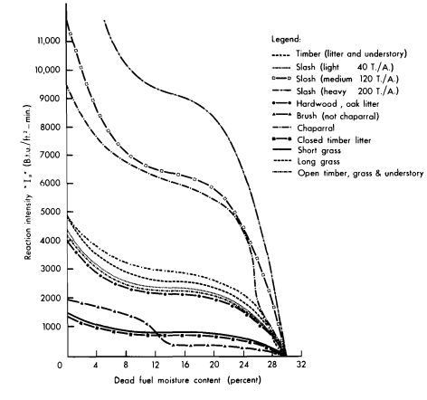

# Fire at home

[Monument Fire, source: Inciniweb](http://inciweb.nwcg.gov/photos/CASHF/2021-08-01-1041-Monument-Fire)

Fortunately we never feel the real threat of the fire season since we live behind the ``redwood curtain.`` In 2017, the neighborhood woke up to a fine layer of white ash on our cars and grass. Fluffly clumps of ash fluttered down from the Santa Rosa fire that was 200+ miles away. More recently in the summer of 2020 when it already seemed like the world was ending, I remember waking up in a hazy orange sepia filter. We hiked in the nearby forest surrounded by ferns and huckleberry, looked out past the redwoods, and stared straight at the red sun. Last year was a little different since our weekend cabin (really, shack!) was om the fire zone. The Monument Fire was the second largest of 2021. It burned 223,124 acres before it was contained 3 months later. 

When we were allowed to go back, the drive through the mountains was disorientating (and wonderous)! Previously, the winding road was so thick with trees that you can barely get a glimpse of Iron Mountain. Now, we could see out uneuncumbered; the hills were toasty gray-brown and the trees were splintered and blackened.

## Wildfires: important in natural cycles and destructive!

Wildfires are an important and part of nutrient cycling and maintaining the health of forests. However, wildfires are dangerous and can threaten biodiversity, human life/health, and human livelihood. Natural wildfires are caused by lightning strikes however most wildfires are caused by people.

Fire prediction is very important in minimizing fire risk and containing fires but very difficult. Fires behave as a chaotic system which is sensitive to many initial parameters.

- Atmospheric: temp, humidity
- Spatial: slope, fuel load, location, proximity to humans, etc

## Literature: 1972 (nomograph) → now (ML)

Many models still use Rothermel’s 1972 fire spread model. Below is a nomograph used by firefighters to predict the movement of the active fire front.

[Rothermel, 1972](https://www.fs.usda.gov/treesearch/pubs/32533)

Current modeling use machine learning to create a predictive map. Below is WildFire Analyst (2019), licensed by Cal Fire. 

